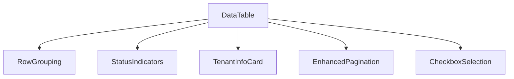

# Data Table Enhancement Plan

## Problem Statement
The current `data-table.tsx` component in `/frontend/components/ui/` lacks several key features and styling elements that are present in the target table from the screenshot. The table needs to be enhanced to match the visual design and functionality of the reference implementation.

## Analysis

### Current Component Limitations
- No row grouping/expandable rows for units/tenants
- No visual status indicators for rent balance (color coding)
- No detailed tenant information cards/modals on row hover/click
- No progress bars for rent balance status
- Basic pagination without detailed statistics
- No row numbering/serial numbers
- Limited styling and visual hierarchy
- No checkboxes for row selection in the current view

### Target Table Features (from screenshot)
1. **Row Grouping**: Expandable rows showing units with multiple tenants
2. **Visual Status Indicators**: Color-coded rent balance status (red for overdue, yellow for warning, green for good)
3. **Detailed Tenant Cards**: Hover/click reveals additional tenant information
4. **Progress Bars**: Rent balance status visualized with color-coded bars
5. **Enhanced Pagination**: Shows page count, records per page, and total records
6. **Row Numbering**: Serial numbers for each row
7. **Advanced Styling**: Multiple colors for different units, hover effects
8. **Checkboxes**: For selecting rows/tenants
9. **Lease Information**: Lease period, days to expire, variation type
10. **Comprehensive Tenant Details**: ID/REG number, Tax PIN, agreement type, tenancy type, contact information

## Solution Plan

### Phase 1: Core Enhancements

#### 1. Row Grouping/Expandable Rows
- Add support for nested data structures where a unit can have multiple tenants
- Implement expand/collapse functionality for grouped rows
- Add visual indicators for expandable rows

#### 2. Visual Status Indicators
- Create color-coded status indicators for rent balance
- Implement logic to determine status based on rent balance values
- Add progress bars to visualize rent balance status

#### 3. Enhanced Tenant Information
- Create a detailed tenant information component
- Implement hover/click interactions to show additional details
- Display comprehensive tenant data including ID, Tax PIN, agreement type, tenancy type

#### 4. Improved Pagination
- Enhance pagination to show detailed statistics
- Display records per page dropdown
- Show total records and page information

### Phase 2: Styling and UX Improvements

#### 1. Advanced Styling
- Implement multi-color row styling for different units
- Add hover effects for interactive elements
- Improve visual hierarchy with different font sizes and weights

#### 2. Row Numbering
- Add serial number column with automatic numbering
- Handle pagination correctly for row numbers

#### 3. Checkbox Selection
- Add checkboxes for row selection
- Implement select all functionality

#### 4. Lease Information Display
- Show lease period, days to expire, and variation type
- Format dates appropriately

### Phase 3: Data Processing

#### 1. Data Transformation
- Process and transform raw data to support the new features
- Handle nested tenant data for grouped rows

#### 2. Calculations
- Implement logic to calculate days to lease expiration
- Determine rent balance status based on predefined rules

## Technical Implementation Approach

### Component Architecture Changes


### Key Dependencies
- @tanstack/react-table (existing)
- Tailwind CSS (existing)
- React state management for expand/collapse functionality
- Date-fns for date calculations

## Detailed Implementation Tasks

### 1. Update Props Interface
```typescript
// Add new props to DataTableProps interface
interface DataTableProps<T> {
  // Existing props...
  enableRowGrouping?: boolean;
  groupByColumn?: keyof T;
  enableStatusIndicators?: boolean;
  statusColumn?: keyof T;
  statusConfig?: StatusConfig;
  enableTenantCards?: boolean;
  tenantDetailsColumn?: keyof T;
  enableRowNumbering?: boolean;
  rowNumberPrefix?: string;
}
```

### 2. Row Grouping Implementation
```typescript
// Add logic to group data by specified column
const groupedData = React.useMemo(() => {
  if (!enableRowGrouping || !groupByColumn) return data;
  return groupDataByColumn(data, groupByColumn);
}, [data, enableRowGrouping, groupByColumn]);

// Render expandable rows
const renderGroupedRow = (group: Group<T>) => (
  <tr>
    <td colspan={columns.length + (enableRowSelection ? 1 : 0)}>
      <div className="flex items-center justify-between">
        <button onClick={() => toggleGroup(group.key)}>
          {group.isExpanded ? '▼' : '▶'} {group.key}
        </button>
        <span>{group.count} tenants</span>
      </div>
    </td>
  </tr>
);
```

### 3. Status Indicator Component
```typescript
// Status indicator component
const StatusIndicator = ({ value }: { value: number }) => {
  const status = determineStatus(value);
  const colors = {
    red: 'bg-red-500',
    yellow: 'bg-yellow-500',
    green: 'bg-green-500',
    gray: 'bg-gray-400'
  };

  return (
    <div className="flex items-center gap-2">
      <div className={`w-2 h-2 rounded-full ${colors[status]}`}></div>
      <span className="text-xs font-medium">{getStatusLabel(status)}</span>
    </div>
  );
};
```

### 4. Tenant Information Card
```typescript
// Tenant information card component
const TenantInfoCard = ({ tenant }: { tenant: Tenant }) => (
  <div className="absolute z-10 bg-white rounded-lg shadow-lg p-4 w-96">
    <div className="flex items-center gap-4">
      <div className="w-16 h-16 bg-gray-200 rounded-full"></div>
      <div>
        <h3 className="font-bold">{tenant.name}</h3>
        <p className="text-sm text-gray-500">{tenant.email}</p>
      </div>
    </div>
    <div className="mt-4 space-y-2 text-sm">
      <div className="flex justify-between">
        <span className="text-gray-500">ID/REG Number:</span>
        <span>{tenant.idNumber}</span>
      </div>
      <div className="flex justify-between">
        <span className="text-gray-500">Tax PIN:</span>
        <span>{tenant.taxPin}</span>
      </div>
      <div className="flex justify-between">
        <span className="text-gray-500">Agreement Type:</span>
        <span>{tenant.agreementType}</span>
      </div>
    </div>
  </div>
);
```

### 5. Enhanced Pagination
```typescript
// Updated pagination component
const EnhancedPagination = ({ table }: { table: TableType }) => (
  <div className="flex items-center justify-between px-2">
    <div className="flex items-center space-x-4">
      <p className="text-sm text-slate-700">
        Displaying {table.getRowModel().rows.length} of {table.getFilteredRowModel().rows.length} records
      </p>
      <Select
        options={[10, 20, 50].map(size => ({ value: size.toString(), label: `${size} per page` }))}
        value={table.getState().pagination.pageSize.toString()}
        onChange={(e) => table.setPageSize(Number(e.target.value))}
      />
    </div>
    <div className="flex items-center space-x-2">
      <Button
        onClick={() => table.previousPage()}
        disabled={!table.getCanPreviousPage()}
      >
        Previous
      </Button>
      <span className="text-sm text-slate-700">
        Page {table.getState().pagination.pageIndex + 1} of {table.getPageCount()}
      </span>
      <Button
        onClick={() => table.nextPage()}
        disabled={!table.getCanNextPage()}
      >
        Next
      </Button>
    </div>
  </div>
);
```

## Testing Strategy

1. **Unit Tests**: Test individual components (StatusIndicator, TenantInfoCard, etc.)
2. **Integration Tests**: Test the DataTable component with various configurations
3. **E2E Tests**: Test user interactions like expanding rows, selecting checkboxes, and changing page size
4. **Visual Regression Tests**: Compare the enhanced table with the reference screenshot

## Performance Considerations

1. **Virtual Scrolling**: Implement for large datasets to improve performance
2. **Debounced Filtering**: Optimize search functionality for large datasets
3. **Memoization**: Use React.memo to optimize component rendering
4. **Lazy Loading**: Load additional data when expanding groups or changing pages

## Conclusion

The enhanced data table will provide a more comprehensive and visually appealing interface for managing tenant information. The implementation will focus on improving usability, adding necessary features, and ensuring the component is flexible and maintainable for future updates.
