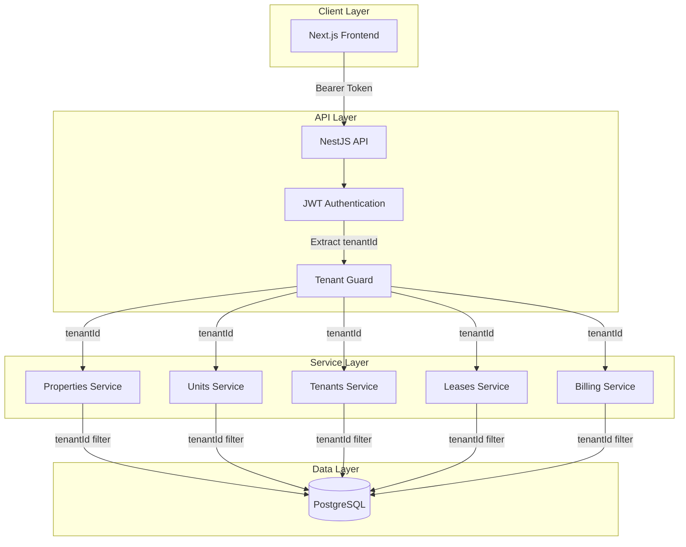
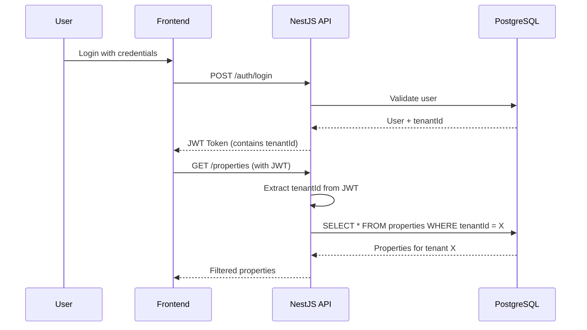

# Multi-Tenant SAAS Implementation Plan

## Overview

This document outlines the implementation of multi-tenancy for the TU Properties application using **row-level security** with a shared database approach. This is the most common and practical approach for SaaS applications.

## Architecture Diagram



## Multi-Tenancy Flow



---

## Phase 1: Database Schema Changes

### 1.1 Create Organization/Tenant Model

New table to represent each tenant (company/organization):

```prisma
model Organization {
  id          String   @id @default(cuid())
  name        String
  slug        String   @unique // For URL identification
  
  // Subdomain configuration
  subdomain   String?  @unique // e.g., "company1" from company1.tuproperties.com
  customDomain String? @unique // e.g., "app.company1.com"
  
  isActive    Boolean  @default(true)
  
  // Subscription
  plan        String   @default("FREE") // FREE, STARTER, PROFESSIONAL, ENTERPRISE
  maxUsers    Int      @default(3)
  maxProperties Int    @default(10)
  
  // Branding (optional white-label)
  logoUrl     String?
  primaryColor String?
  
  // Contact
  contactEmail String?
  contactPhone String?
  
  // Relationships
  users       User[]
  properties  Property[]
  tenants     TenantRecord[]
  landlords   Landlord[]
  
  createdAt   DateTime @default(now())
  updatedAt   DateTime @updatedAt
  
  @@map("organizations")
}
```

### 1.2 Update User Model

Add organization/tenant relationship:

```prisma
model User {
  // ... existing fields ...
  
  // Tenant relationship
  organizationId String?
  organization   Organization? @relation(fields: [organizationId], references: [id])
  
  @@index([organizationId])
}
```

### 1.3 Add tenantId to All Data Entities

These models need a tenantId foreign key:

| Model | Current State | Required Change |
|-------|---------------|-----------------|
| Landlord | No tenantId | Add tenantId |
| Property | No tenantId | Add tenantId |
| Unit | No tenantId | Add tenantId |
| Tenant | No tenantId | Add tenantId |
| TenantEmergencyContact | No tenantId | Add tenantId |
| Lease | No tenantId | Add tenantId |
| Invoice | No tenantId | Add tenantId |
| InvoiceItem | No tenantId | Add tenantId |
| Payment | No tenantId | Add tenantId |
| PropertyStandingCharge | No tenantId | Add tenantId |
| PropertySecurityDeposit | No tenantId | Add tenantId |
| UnitServiceCharge | No tenantId | Add tenantId |
| UnitMeterNumber | No tenantId | Add tenantId |
| UnitFeature | No tenantId | Add tenantId |

---

## Phase 2: Backend Implementation

### 2.1 JWT Token Changes

Update JWT payload to include tenantId:

```typescript
// auth.service.ts - login method
const payload = { 
  email: user.email, 
  sub: user.id, 
  role: user.role,
  tenantId: user.organizationId  // Add this
};
```

### 2.2 Tenant Context

Create tenant context to extract and use tenant information:

```typescript
// common/decorators/tenant.decorator.ts
export const Tenant = createParamDecorator(
  (data: unknown, ctx: ExecutionContext) => {
    const request = ctx.switchToHttp().getRequest();
    return request.user?.tenantId;
  }
);

// common/decorators/current-user.decorator.ts
export const CurrentUser = createParamDecorator(
  (data: unknown, ctx: ExecutionContext) => {
    const request = ctx.switchToHttp().getRequest();
    return request.user;
  }
);
```

### 2.3 Tenant Guard

Create a guard that enforces tenant isolation:

```typescript
// common/guards/tenant.guard.ts
@Injectable()
export class TenantGuard implements CanActivate {
  canActivate(context: ExecutionContext): boolean {
    const request = context.switchToHttp().getRequest();
    const user = request.user;
    
    // Super admins can access all tenants
    if (user.role === 'SUPER_ADMIN') {
      return true;
    }
    
    // Regular users must have a tenant
    if (!user.tenantId) {
      throw new ForbiddenException('No tenant association');
    }
    
    return true;
  }
}
```

### 2.4 Service Layer Updates

All services need to filter by tenantId. Create a base service pattern:

```typescript
// common/services/tenant-scoped.service.ts
@Injectable()
export abstract class TenantScopedService {
  protected abstract get tenantId(): string | null;
  
  protected getFindAllOptions(prismaOptions: any = {}) {
    // If SUPER_ADMIN and no tenant filter specified, return all
    // Otherwise filter by tenantId
    return {
      where: {
        ...prismaOptions.where,
        organizationId: this.tenantId
      }
    };
  }
}
```

Example - Properties Service updated:

```typescript
// properties.service.ts
@Injectable()
export class PropertiesService {
  constructor(
    private prisma: PrismaService,
    @Inject(REQUEST) private request: Request,
  ) {}

  private get tenantId(): string | null {
    const user = this.request.user as any;
    if (user?.role === 'SUPER_ADMIN') {
      return null; // Return all
    }
    return user?.tenantId || null;
  }

  findAll() {
    const where = this.tenantId 
      ? { organizationId: this.tenantId }
      : {};
    return this.prisma.property.findMany({ where });
  }

  findOne(id: string) {
    const where = this.tenantId
      ? { id, organizationId: this.tenantId }
      : { id };
    return this.prisma.property.findUnique({ where });
  }
}
```

### 2.5 Organization Module

Create CRUD operations for managing tenants:

```
backend/src/organizations/
├── organizations.module.ts
├── organizations.controller.ts
├── organizations.service.ts
└── dto/
    ├── create-organization.dto.ts
    └── update-organization.dto.ts
```

### 2.6 Subdomain Middleware

Create middleware to extract tenant from subdomain:

```typescript
// common/middleware/subdomain.middleware.ts
@Injectable()
export class SubdomainMiddleware implements NestMiddleware {
  constructor(private organizationService: OrganizationsService) {}
  
  async use(req: Request, res: Response, next: NextFunction) {
    const host = req.headers.host; // e.g., "company1.tuhame.co.ke"
    const subdomain = this.extractSubdomain(host);
    
    if (subdomain && subdomain !== 'www' && subdomain !== 'app') {
      const organization = await this.organizationService.findBySubdomain(subdomain);
      if (organization) {
        req['organizationId'] = organization.id;
        req['organization'] = organization;
      }
    }
    
    next();
  }
  
  private extractSubdomain(host: string): string | null {
    if (!host) return null;
    const baseDomain = process.env.BASE_DOMAIN || 'tuhame.co.ke';
    const subdomain = host.replace(`.${baseDomain}`, '');
    return subdomain === host ? null : subdomain;
  }
}
```

### 2.7 Auth Guard with Subdomain Support

Update the JWT strategy to also check subdomain:

```typescript
// auth/jwt.strategy.ts - validate method
async validate(payload: any) {
  // If user has tenantId in token, use it
  // Otherwise, try to get from subdomain header
  const tenantId = payload.tenantId || payload.organizationId;
  
  return { 
    userId: payload.sub, 
    email: payload.email, 
    role: payload.role,
    tenantId
  };
}
```

---

## Phase 3: Frontend Implementation

### 3.1 Update Types

```typescript
// types/index.ts
export interface Organization {
  id: string;
  name: string;
  slug: string;
  domain?: string;
  plan: string;
  logoUrl?: string;
}

export interface User {
  id: string;
  email: string;
  firstName: string;
  lastName: string;
  role: 'SUPER_ADMIN' | 'ADMIN' | 'PROPERTY_MANAGER' | 'ACCOUNTANT' | 'USER';
  organizationId?: string;
  organization?: Organization;
}
```

### 3.2 Auth Context Updates

```typescript
// context/auth-context.tsx
interface AuthContextType {
  user: User | null;
  organization: Organization | null;  // Add organization
  token: string | null;
  login: (token: string, user: User) => void;
  logout: () => void;
  isLoading: boolean;
}
```

### 3.3 Tenant Management UI

Create pages for super admins:

```
frontend/app/dashboard/organizations/
├── page.tsx          // List all organizations
└── [id]/page.tsx    // View/edit organization
```

### 3.4 Registration Flow

Update registration to create organization:

```
frontend/app/auth/register/
├── page.tsx    // Step 1: User info + password
└── onboarding/
    └── page.tsx  // Step 2: Create organization
```

### 3.5 Subdomain Detection & Routing

Create utility to handle subdomain-based routing:

```typescript
// lib/tenant.ts

export function getSubdomain(): string | null {
  if (typeof window === 'undefined') return null;
  
  const hostname = window.location.hostname;
  const baseDomain = process.env.NEXT_PUBLIC_BASE_DOMAIN || 'tuhame.co.ke';
  
  if (hostname === baseDomain || hostname === `www.${baseDomain}`) {
    return null; // Main app
  }
  
  return hostname.replace(`.${baseDomain}`, '');
}

export function getTenantUrl(subdomain: string): string {
  const baseDomain = process.env.NEXT_PUBLIC_BASE_DOMAIN || 'tuhame.co.ke';
  return `https://${subdomain}.${baseDomain}`;
}

// In middleware or layout
// Detect if user is on subdomain and fetch tenant config
```

### 3.6 Dynamic Organization Context

Update auth context to include organization from subdomain:

```typescript
// context/auth-context.tsx
useEffect(() => {
  const subdomain = getSubdomain();
  if (subdomain) {
    // Fetch organization by subdomain
    organizationApi.getBySubdomain(subdomain).then(org => {
      setOrganization(org.data);
    });
  }
}, []);
```

---

## Phase 4: Migration Strategy

### 4.1 Data Migration Steps

1. **Backup database** - Always backup before migration
2. **Create default organization** - Create "System" or "Default" organization
3. **Migrate existing data** - Assign all existing records to default organization
4. **Verify data** - Ensure all records have tenantId
5. **Add NOT NULL constraint** - After verification

### 4.2 Migration Script

```sql
-- Step 1: Add nullable tenantId column
ALTER TABLE organizations ADD COLUMN IF NOT EXISTS id UUID DEFAULT gen_random_uuid();

-- Step 2: Create default organization
INSERT INTO organizations (id, name, slug, created_at, updated_at)
VALUES ('00000000-0000-0000-0000-000000000001', 'Default Tenant', 'default', NOW(), NOW());

-- Step 3: Update all tables with default tenantId
UPDATE properties SET organization_id = '00000000-0000-0000-0000-000000000001' WHERE organization_id IS NULL;
UPDATE units SET organization_id = '00000000-0000-0000-0000-000000000001' WHERE organization_id IS NULL;
-- ... repeat for all tables

-- Step 4: Add foreign key constraints
ALTER TABLE properties ALTER COLUMN organization_id SET NOT NULL;
-- ... repeat for all tables
```

---

## Phase 5: Testing Checklist

### 5.1 Backend Tests

- [ ] User from Tenant A cannot access Tenant B's properties
- [ ] Super admin can access all tenants' data
- [ ] New user registration creates organization
- [ ] JWT token contains correct tenantId

### 5.2 Frontend Tests

- [ ] Login redirects to dashboard
- [ ] Dashboard shows only tenant's properties
- [ ] Super admin sees all organizations
- [ ] Tenant switch works (if applicable)

---

## Summary

This implementation provides:

1. **Complete data isolation** - Each tenant can only see their own data
2. **Super admin access** - Platform admins can access all data
3. **Subdomain-based access** - Each tenant gets `company1.tuproperties.com`
4. **Custom domain support** - Tenants can use their own domain
5. **Scalable architecture** - Row-level security scales to thousands of tenants
6. **Easy querying** - Simple SQL queries with tenantId filter
7. **Future-ready** - Can add more advanced routing later if needed

The approach is:
- ✅ Easy to implement
- ✅ Scales well (100s-1000s of tenants)
- ✅ Cost-effective (single database)
- ✅ Low maintenance overhead
- ✅ Professional SaaS appearance with subdomains

---

## Environment Variables Required

### Backend (.env)
```
# Database
DATABASE_URL=postgresql://...

# JWT
JWT_SECRET=your-secret-key

# Multi-tenancy
BASE_DOMAIN=tuhame.co.ke  # Base domain for subdomain extraction
```

### Frontend (.env)
```
# API
NEXT_PUBLIC_BACKEND_URL=http://localhost:3003

# Multi-tenancy
NEXT_PUBLIC_BASE_DOMAIN=tuhame.co.ke
NEXT_PUBLIC_APP_URL=https://app.tuhame.co.ke
```
